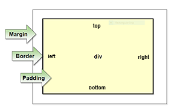

<h1>CSS Box info</h1>

Margin - pushes out from border

Padding - pushes in from border

The margin element is able to take all four values in line.

margin: 5px 10px 5px 10px (top right bottom left)

