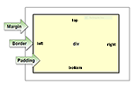

# CSS Box info

Note that the Browser's Development tool has the ability to show the specifics for the box info.

Margin - pushes out from border

Padding - pushes in from border

The margin element is able to take all four values in line.

margin: 5px 10px 5px 10px (top right bottom left)

border-bottom: 5px solid red; (size type color) - Also works with border-top, border-right, border-left

Vertical margins overlap. E.g.; A 3px margin bottom meeting a 5px margin top would only display the largest margin of 5px.
